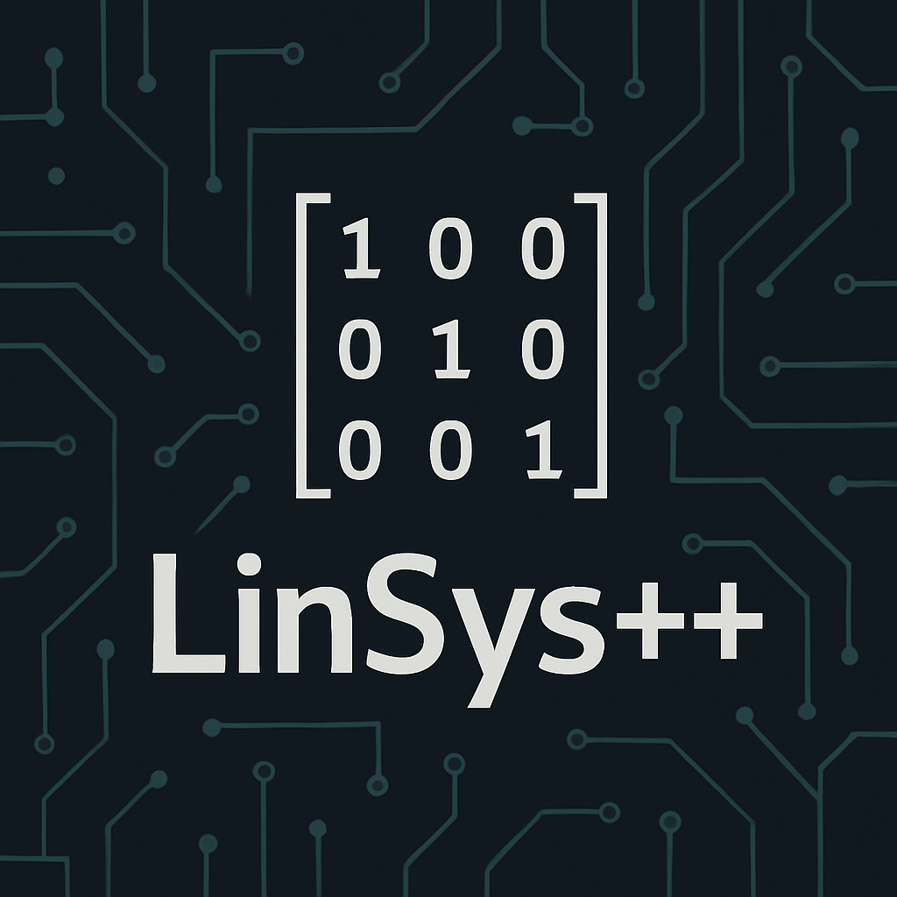

# LinSys++

Linear system solver using Gauss, Gauss-Jordan, Jacobi, and Gauss-Seidel methods in C++. 

This is a **pure C++** console program that allows you to solve systems of linear equations using **Gauss elimination**, **Gauss-Jordan elimination**, **Jacobi iteration**, and **Gauss-Seidel iteration** methods.  
Designed as both an educational and functional tool, it is ideal for engineering students, linear algebra, or numerical methods courses.

---

## Features

- Step-by-step solution using the **Gauss** method.
- Step-by-step solution using the **Gauss-Jordan** method.
- Iterative solution using the **Jacobi** method.
- Iterative solution using the **Gauss-Seidel** method.
- Simple and clear console interface.
- No external dependencies: can be compiled with any standard C++ compiler.

---

## Requirements

- Operating system with a console (Windows, Linux, macOS).

---

## Usage

### 1. Run

The program runs in the console.  
On startup, it will ask you for:

- The method you want to use to solve your system.
- The dimension of the system.
- The data for matrix A (the program will indicate the position of the matrix entry you are entering).
- The data for vector b.
- Whether you want to display the solution steps if the system and method allow it (enter 1 for yes, 0 for no).
- You can solve as many systems as you want; to exit, select option 5.

### 2. Example input

### 3. Example output

---

## Project status

This is the second major update after release 1.2.2

---

## Contributions

All feedback or suggestions are welcome!  
You can submit a pull request if you wish to contribute.

---

## License

Project licensed under the MIT License.  
This means it can be used, modified, and distributed even for commercial purposes, as long as the original credit is maintained.

---

## Author

Developed by Sergio Gonzalez -- electronics engineering student and cybersecurity enthusiast.  
This project is 100% free and open. If it has helped you and you want to support me as a student, you can buy me a coffee:

https://coff.ee/phillipnoir

Or directly via PayPal:

https://www.paypal.me/CienceMessiah

---

# LinSys++

Solución de sistemas lineales por Gaus, Gauss-Jordan, Jacobi y Gauss-Seidel en C++. Linear system solver using Jacobi and Gaussian methods

Este es un programa de consola en **C++ puro** que permite resolver sistemas de ecuaciones lineales utilizando los métodos de **eliminación de Gauss**, **eliminación Gauss-Jordan**, **iteración de Jacobi** e **iteración de Gauss-Seidel**.
Diseñado como una herramienta educativa y funcional, es ideal para estudiantes de ingeniería, álgebra lineal o métodos numéricos.

---

## Características

- Resolución paso a paso por el método de **Gauss**.
- Resolución paso a paso por el método de **Gauss-Jordan**.
- Resolución iterativa por el método de **Jacobi**
- Resolución iterativa por el método de **Gauss-Seidel**
- Interfaz por consola simple y clara.
- Sin dependencias externas: compilable con cualquier compilador estándar de C++.

---

## Requisitos

- Sistema operativo con consola (Windows, Linux, macOS).

---

## Uso

### 1. Ejecutar

El programa se ejecuta en consola.
Al iniciarse, le pedirá:

- El método por el que deseas resolver tu sistema.
- La dimensión del sistema.
- Ingresar los datos de la matriz A (el mismo programa indicará la posición de la matriz que está ingresando).
- Ingresar los datos del vector b.
- Pregunta si desea que se muestren los pasos de la solución si el sistema y el método lo permiten (ingresar 1 para si, 0 para no).
- Puede hacer cuantos sistemas desee, para salir debe seleccionar la opción 5.

### 2. Ejemplo de entrada

### 3. Ejemplo de salida

---

## Estado del proyecto

Esta es la segunda mayor actualización post-lanzamiento 1.2.2

---

## Contribuciones

¡Toda retroalimentación o sugerencia es bienvenida!
Puedes hacer un pull request si deseas colaborar

---

## Licencia

Proyecto licenciado bajo la licencia MIT.
Significa que puede ser usado, modificado y distribuido incluso con fines comerciales, siempre que se mantenga el crédito original.

---

## Autor

Desarrollado por Sergio Gonzalez -- estudiante de ingeniería en electrónica y apasionado por la ciberseguridad.
Este proyecto es 100% libre y gratuito. Si te ha ayudado y quieres apoyarme como estudiante, puedes invitarme un café:

https://coff.ee/phillipnoir

O con paypal directamente:

https:://www.paypal.me/CienceMessiah

